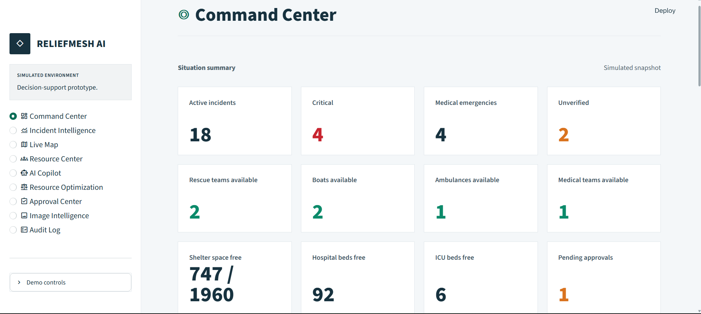
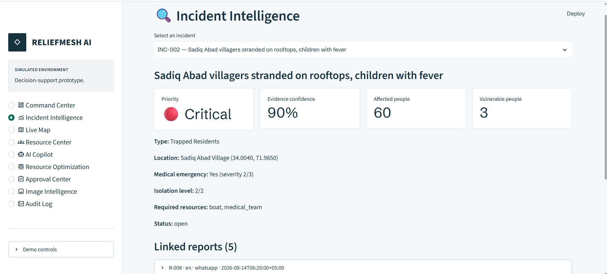
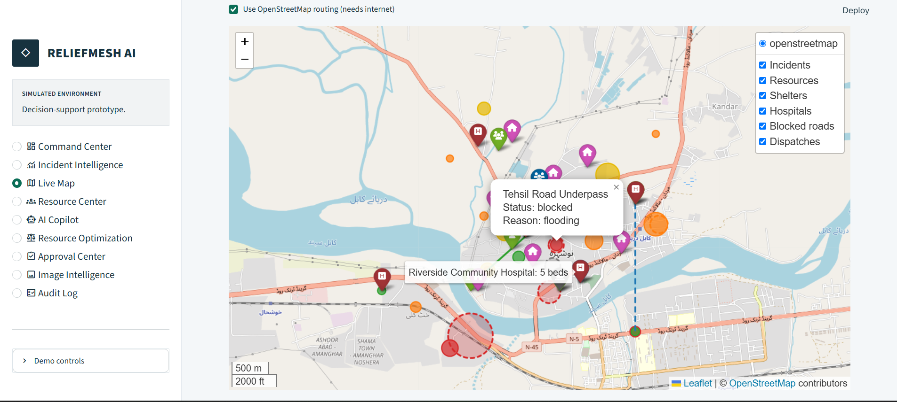
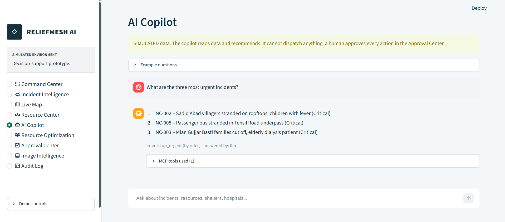
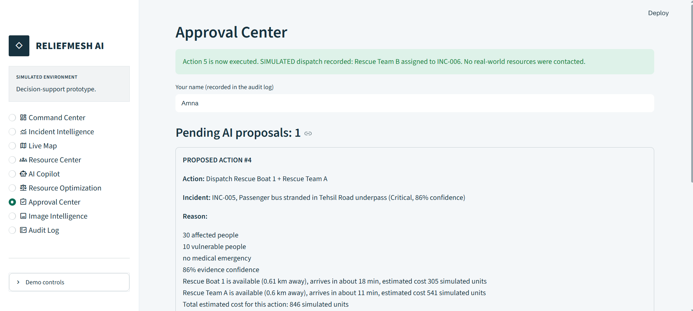
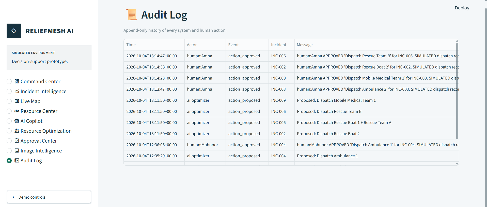
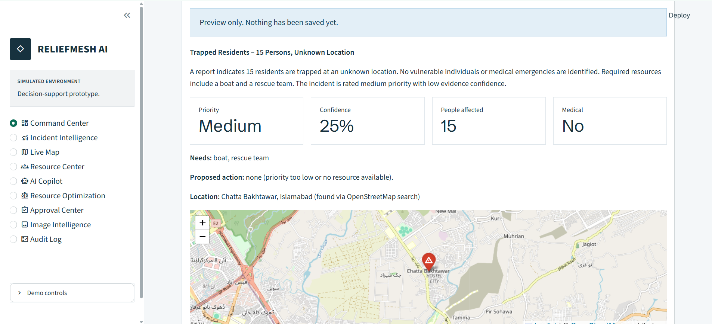
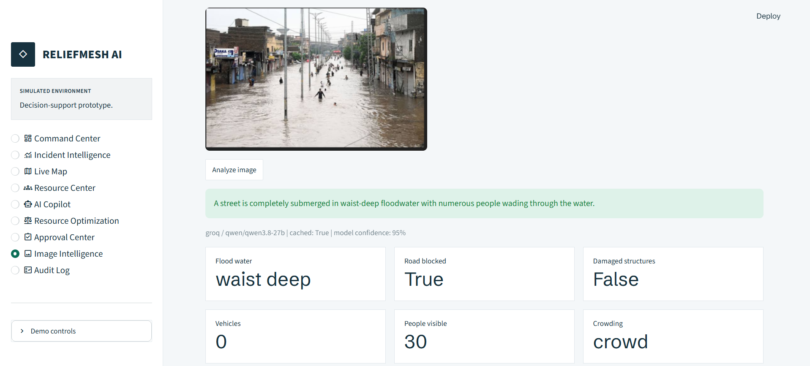

# ReliefMesh AI

**AI-assisted disaster-response coordination. Humans decide, every time.**

ReliefMesh AI turns messy field reports into verified incidents, ranks them by priority, proposes where boats, medical teams, ambulances and shelters should go, and routes around blocked roads. Nothing is dispatched until a named person approves it, and every step is written to a tamper-proof audit log.

The demo runs on a simulated Kabul River flood. All data is simulated.

**Live demo:** <your Streamlit link>  |  **API:** <your Render link>/docs


---

## Why it matters

In a flood, reports arrive in different languages, some are duplicates, some are wrong, and there are never enough boats. Coordinators lose time sorting messages instead of making decisions. ReliefMesh AI does the sorting, scoring and planning, and leaves the decision to a person.

## Features

| Feature | What it does |
|---|---|
| Multilingual intake | Reads reports in English, Roman Urdu and Urdu. Extracts place, people affected, medical need and required resources. |
| Verification | Merges duplicate reports into one incident and gives an evidence confidence score. Low-confidence incidents are marked Unverified. |
| Priority scoring | Rates each incident Critical, High, Medium or Low with a short reason. |
| Resource matching | Suggests the nearest suitable boats, rescue teams, ambulances, shelters and hospitals. |
| Routing | Real road routes with OSRM and OpenStreetMap, avoiding blocked roads. |
| Optimizer | An OR-Tools plan that weighs travel time, cost, time windows and budget. |
| AI Copilot | Answers questions using read-only tools, then checks its answer against the data. |
| Image Intelligence | A vision model reads flood photos and adjusts evidence confidence slightly. |
| Approval Center | A named person approves, rejects or asks for more information. |
| Audit Log | Append-only record of every decision. Rows cannot be edited or deleted. |
| Test a new scenario | Type a new report such as "Heavy flood on Nala Lai in Rawalpindi". The app finds the place, scores it and shows a preview. Save it, and it appears on the map, in Incident Intelligence, in the Approval Center and in the Copilot. |
| Place search | Search any place in the world on the Live Map. |

## Screenshots



| | |
|---|---|
|  **Incident Intelligence**: merged reports, confidence and priority reasoning |  **Live Map**: incidents, blocked roads and routes |
|  **AI Copilot**: grounded answers with sources |  **Approval Center**: a named human decides |
|  **Audit Log**: append-only trail |  **Test a new scenario**: preview before saving |
|  **Image Intelligence**: photo analysis | |

## How it works

```
Streamlit UI  --HTTP-->  FastAPI backend  --->  SQLite
                              |-- agent crew (fixed sequence)
                              |-- 3 read-only MCP servers (incident, resource, mapping)
                              |-- OR-Tools CP-SAT optimizer
                              |-- Groq LLM (text and vision)
                              `-- OSRM / OpenStreetMap routing
```

The agent crew runs in a fixed order:

1. **Intake** extracts structured facts from each report.
2. **Verification** merges duplicates and scores confidence.
3. **Priority** ranks the incident.
4. **Resource** matches suppliers and shelters.
5. **Routing** finds a road route.
6. **Approval** creates a proposed action and waits for a person.

A fixed order makes results repeatable and means the AI never decides whether a safety step runs.

**Tech:** Streamlit, FastAPI, SQLite, MCP SDK, OR-Tools, fastembed (MiniLM), Groq, OpenStreetMap, OSRM, Folium. Everything is open-source or free tier.

## Safety by design

- **Human in the loop.** Only `human:<name>` can approve or reject. The database enforces this.
- **Simulated dispatch.** Approving records a decision. No real resources are contacted.
- **AI never edits resources.** Only approved human actions change resource rows.
- **Tamper-proof audit.** Database triggers block edits and deletes on audit rows.
- **Read-only tools.** The Copilot can read data but cannot change it.
- **Grounded answers.** The Copilot checks incident IDs and numbers against the database.

## Run locally (Windows, PowerShell)

```powershell
python -m venv .venv
.venv\Scripts\Activate.ps1
pip install -r requirements.txt
copy .env.example .env
python scripts/init_db.py
```

Open `.env` and add your key: `GROQ_API_KEY=your_key_here`

Start the two servers in two terminals:

```powershell
# Terminal 1: backend
uvicorn backend.main:app --reload --port 8000

# Terminal 2: frontend
streamlit run frontend/app.py
```

Open http://localhost:8501

## Deploy

The backend runs on Render (`render.yaml`) and the frontend on Streamlit Community Cloud. Set `BACKEND_URL` in the Streamlit app secrets to your Render URL.

## Try it in 5 minutes

1. **Command Center**: read the snapshot, then open *Test a new scenario*.
2. Type `Heavy flood on Nala Lai in Rawalpindi, 40 people stuck, need boat`, click **Analyze**, then **Save**.
3. **Incident Intelligence**: find your new incident.
4. **Live Map**: see it on the map. Search another place.
5. **Resource Optimization**: run the plan, then send it to the Approval Center.
6. **Approval Center**: type your name and approve one action.
7. **AI Copilot**: ask "Which critical incidents have no boat yet?"
8. **Audit Log**: see every step you just took.

Use **Demo controls > Reset demo data** in the sidebar to return to the starting state.

## Project layout

```
agents/      crew, optimizer, copilot, image agent
backend/     FastAPI routes
frontend/    Streamlit pages and theme
mcp_servers/ incident, resource and mapping tools
scripts/     database setup and seeding
docs/        screenshots and notes
```

## Notes

- All incidents, resources and people are simulated.
- Routing uses the public OSRM server and switches to straight-line distance if it is unreachable.
- Free-tier hosting sleeps when idle, so the first load can take about a minute.
